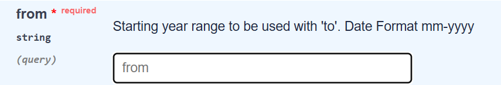

# Individual-Project
Repository for Final Project (Individual)
Names of all Team Members:
- Christian Russell Susanto

# Big Idea/Goal/Why did I do this?

Hate Crimes are things that people see all the time. Whether on social media, in real-life or experiencing it themselves. However, the public rarely sees them visualized in a clear and accessible way. Some barriers could be due to certain state-by-state differences, inconsistent reporting practices, and long-term trends are often hidden behind complex federal data.

My  Hate Crime Trends Explorer website transforms that hidden data into an intuitive web application.
Where users can obtain that information by:
- Selecting any U.S. state
- Choose a year range
- And instantly visualize hate-crime incident rates over time
- While also getting a view of the summary statistics that highlight major trends

The people who would typically use this application are policymakers, researchers, students, or activists who wants to gain a better understanding of hate crime trends for their research or website. Then this would be an amazing application since it is interactive and intuitive. 

Let's take for example that there is someone who wants to see whether hate crimes in Massachusetts have increased since 2000. With this application, you simply:
#1 Choose Massachusetts (MA) from the state dropdown box
#2 Select 2000–2010
#3 Click Show Graph
Within seconds, the app retrieves official FBI data, processes it, and renders a clean historical trend graph with automated insights. This project demonstrates how software design, APIs, data processing, and visualization can be combined to assist people in their education and answer their meaningful real-world questions.

# User Instructions/README
(Prior to the instructions, make sure you have VS code and Github installed)
Step #1: Go to my repository in Github https://github.com/ChristianRussell-ship-it/Individual-Project
Step #2: Click the green code button 
Step #3: Select open with Github desktop 
- GitHub Desktop will open automatically.
- Choose a folder on your computer where you want the project to be saved.
Step #4 Click Clone and open the folder in VS code
Step #5 
This project uses the FBI Crime Data Explorer API.
For security reasons, my personal API key is not included in the repository.
After cloning the repo, you must create your own key at https://api.data.gov/signup/ and then create a .env file in the INDIVIDUAL-PROJECT folder with:

FBI_API_KEY= (your_api_key_here)

This is free and anyone can do it. 

Step #6: Run the application by typing (python app.py) in your terminal, if successful, you should see 
(Running on http://127.0.0.1:5000)
To which you should click on the link and open this URL in any browser to use the app!

# Implementation Information

Project Architecture and Design Philosophy:
- crime_api.py handles all communication with the FBI API
- data_processing.py extracts and standardizes yearly values
- app.py coordinates user input, application logic, and rendering
- templates/*.html define the presentation layer (UI)

API Layer (Building a Reliable Connection to FBI Data)
Often times I experienced
- Slow responses
- Occasional timeouts

But most importantly, I experienced errors that I couldn't find what was wrong with it 
Thats why with the help of AI (Chatgpt), I created a Retry Logic that:
- Uses fetch_with_retry() function to attempto to call each API request up to 3 times, with timeout handling:
- Prevents the app from freezing
- Allows recovery from temporary API downtime

Date Formatting
- The FBI API requires a special "MM-YYYY" format.
- To ensure correctness, I automatically convert user inputs into the correct structure (01-2000, 01-2010, etc.)

Data Processing Layer (Cleaning and Standardizing Data)
The API sometimes returns:
- Empty lists
- Missing fields
- Nested lists with only one item

Different key naming conventions
To address this, data_processing.py includes:
A Defensive Parsing that checks for:
- missing keys
- empty results
- invalid values
So that the app doesn’t crash if the API returns odd data.

Web Application Layer (Flask as the User Interaction Framework)
GET / Displays the search form
POST / Handles submitted user inputs

Input Validation:
I implemented a multi-step validation process:
- Check if both years are provided 
- Doesn't allow same year inputs 
- Ensure end year > start year 
- Catch invalid ranges
- Inputs are forced to be numeric

This ensures the application behaves predictably and gives a good user experience.

After validation:
- API data is fetched
- Years and counts are extracted
- A Matplotlib line graph is generated
- The image is saved into static/
- The HTML page loads the graph dynamically

index.html:
- State dropdown
- Year inputs
- Graph-type selector
- Error message display

results.html:
- Displays Matplotlib graph
- Shows summary statistics
- Offers a link to return to the form
- The layout is intentionally minimalistic so users focus on the graph and insights, butI wish I had more time to make it cleaner

# Results
California (2000–2020)
This sample graph shows hate-crime incidents in California over two decades.
It demonstrates how the application handles a long time range and a state with large sample sizes.
Example: 

Massachusetts (2010–2015)
This example analyzes a shorter time range for Massachusetts.
It shows the application’s ability to generate clean visualizations even when fewer data points are available.
Exmaple: 

# Project Evolution/Narrative
I initially wanted to create a more sophisticated project where I take daily crime data and create sort of a news app with it. It would update daily depending on new information on crime in the area, but the only API that I could find that would be suitable for it somehow didn't work anymore. Thats how I pivoted to working on this project where people can get a trend line over time on crime in states. This project is more general rather than the specific project I had in mind but I am happy with the results. 

# Attribution
I have to give credit to FBI Crime Data API, which helped me with the API calling. 
Credit to: https://cde.ucr.cjis.gov/LATEST/webapp/#/pages/docApi 

This project used and depends on the following tools and external resources:
FBI Crime Data Explorer API – for retrieving hate-crime statistics
Flask – backend web framework
Matplotlib – for generating line graphs
GitHub Desktop / VS Code - with development
Requests – Python HTTP library used to send GET requests to the FBI API and receive JSON responses.  
Python-dotenv – Loads the `FBI_API_KEY` from the `.env` file so the API key stays out of the code and isn’t pushed to GitHub.  

AI Assistance Disclosure:
During this project, I made use of AI tools such as ChatGPT at various points in the development process. I primarily used it the same way I would use documentation or Stack Overflow: to help me understand errors, interpret confusing parts of the FBI API documentation, and figure out how to structure certain parts of the application. It also helped me with code generation such as:
- Designing the structure of get_hate_crime_trends() to extract the correct fields from the FBI API
- Setting up input validation logic inside app.py (checking year ranges, empty inputs, etc.)
- Creating the summary statistics calculation (max/min year, percent change)
- Drafting parts of the Flask routing logic for GET/POST requests
- Formatting the Matplotlib graph generation
- Helping shape the structure for results.html and the error-message system in index.html  
- Troubleshooting API request issues and understanding why certain responses failed
- Getting clarification on how the FBI API formats its parameters
- Shaping the retry logic and improving the error handling
- Organizing the layout of my Flask routes and validation checks
- Improving the readability and structure of the codebase
- Getting feedback on how to explain or document certain parts of the project

# Conclusion:
The Hate Crime Trends Explorer demonstrates how software design, APIs, and data visualization can be combined to create an interactive analytic tool. Although the project began as a compeltely different project altogether, it evolved into a complete web application with validation, error handling, and dynamic plotting.